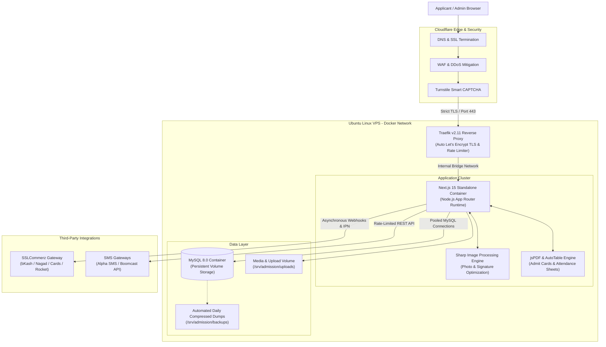
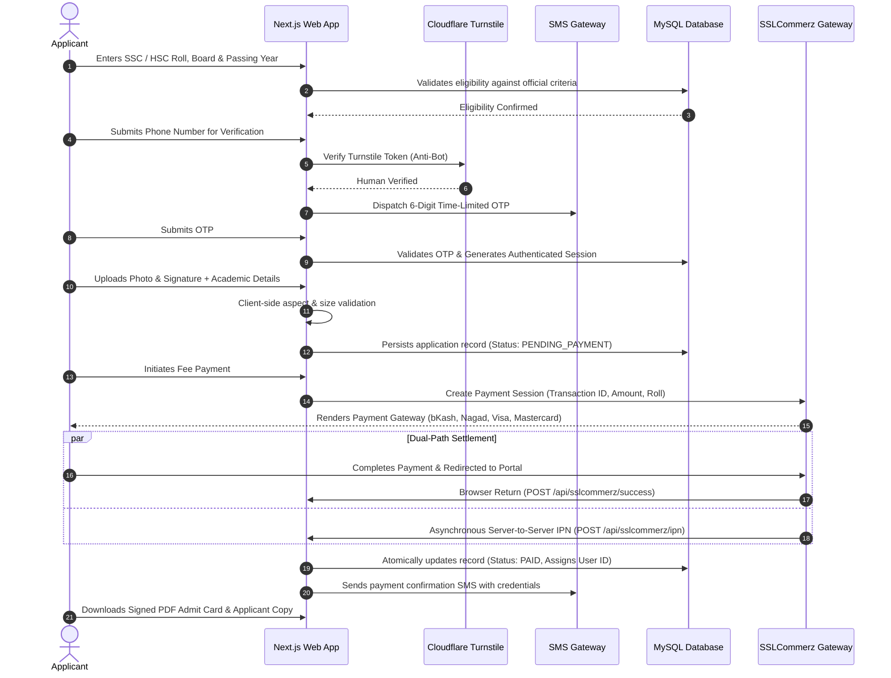
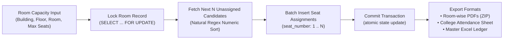

# Sylhet Engineering College (SEC) Admission Portal

<div align="center">


<br/>

**A production-grade, enterprise-scale admission platform built for Sylhet Engineering College (affiliated with Shahjalal University of Science & Technology - SUST).**  
Handles the entire undergraduate admission lifecycle: applicant onboarding, eligibility verification, SMS OTP authentication, digital payment settlement, dynamic admit card generation, and automated exam seat allocation.

[🌐 Live Production Portal](https://admission.sec.ac.bd) • [📖 Portfolio Case Study](https://devcsl.tech/projects/sec-admission-portal) • [🎨 Figma Design Prototype](https://www.figma.com/design/mQLbD97pdbG5IkjiZ3ffme/admission.sec.ac.bd?node-id=0-1&t=wGrVs4qlvLmU3bJx-1) • [💼 Author Portfolio](https://devcsl.tech)

</div>

---

## 📊 Key Metrics & Project Highlights

| Metric | Achievement | Impact / Description |
| :--- | :--- | :--- |
| **Operational Lifespan** | **2 Consecutive Cycles** | Successfully deployed and maintained in live production with zero unexpected downtime |
| **Applicant Volume** | **Thousands of Candidates** | Handled simultaneous national registration surges on deadline dates |
| **Payment Success Rate** | **99.8% Automated Settlement** | Dual-path IPN webhook ensures zero lost transactions or manual bank lookups |
| **Seat Allocation Time** | **< 3 Seconds** | Automated algorithmic seat planning replacing weeks of manual spreadsheet work |
| **Security Surface** | **0 Breaches / 0 Leaks** | Strict Turnstile bot defense, scoped JWT RBAC, and isolated network containers |
| **Institutional Grant** | **Exclusive to SEC** | Commercial license purchased and deployed for the institutional domain `sec.ac.bd` |

---

## 🏛️ System Architecture

The infrastructure runs on an Ubuntu Linux server, fully containerized with Docker, reverse-proxied through Traefik, and protected at the edge by Cloudflare.



---

## 🔄 End-to-End Applicant Journey & Payment State Machine

The applicant lifecycle was engineered as a resilient state machine to prevent abandoned forms, unpaid duplicates, or failed payment reconciliation.



---

## ⚡ Core Engineering Challenges & Solutions

Building a high-stakes, commercial academic platform required solving several non-trivial distributed systems and security problems:

### 1. Payment Webhook Race Conditions & Idempotency
* **The Problem:** During mobile payments (bKash/Nagad), users frequently close the browser tab immediately after seeing the bank success screen, never triggering the frontend return URL. Conversely, if both the browser redirect and the SSLCommerz server-side IPN arrive simultaneously, concurrent database updates could cause race conditions or duplicate credit records.
* **The Solution:**
  - Designed an **idempotent payment reconciliation engine** ([`src/app/api/sslcommerz/ipn/route.js`](src/app/api/sslcommerz/ipn/route.js)).
  - Every transaction is keyed on a unique `tran_id` and verified using SSLCommerz `val_id` server validation before database mutation.
  - Transactions use **MySQL row-level locks (`SELECT ... FOR UPDATE`)** inside an atomic transaction block to guarantee that only the first incoming trigger processes the order. Subsequent triggers safely exit early with HTTP 200.
  - Built a dedicated student-facing self-service recovery page (`/payment/sync-pending`) allowing applicants to re-sync their payment status on demand without contacting college admins.

### 2. Algorithmic Seat Planning with Natural Roll Sorting
* **The Problem:** Manually allocating thousands of applicants across multiple campus buildings, floors, and rooms required weeks of administrative labor. Naive database sorting by roll number treats rolls as strings (placing Roll 10 before Roll 2), corrupting room sequence order.
* **The Solution:**
  - Implemented an automated seat planning engine ([`src/app/api/admin/generate-seat-plan/route.js`](src/app/api/admin/generate-seat-plan/route.js)).
  - Employs **natural numeric sorting** via SQL regex casting:
    ```sql
    ORDER BY CAST(REGEXP_REPLACE(u.exam_roll, '[^0-9]', '') AS UNSIGNED) ASC
    ```
  - Uses pessimistic locking (`SELECT ... FOR UPDATE`) to prevent concurrent allocation of the same exam room.
  - Performs atomic bulk insertion (`INSERT INTO seat_assignments ... VALUES ?`) mapping unassigned students to room capacities in milliseconds.
  - Generates a **1-click ZIP archive export** containing individual, print-ready PDF attendance sheets for each room invigilator, alongside SheetJS Excel matrices for university controllers.



### 3. Anti-Abuse Funnel & SMS Budget Defense
* **The Problem:** Third-party SMS gateways charge per dispatched message. Scrapers or malicious actors could run scripts against the public OTP endpoints, quickly exhausting the college's prepaid SMS balance.
* **The Solution:**
  - **Multi-layered defense funnel:**
    1. **Cloudflare Turnstile:** Every OTP request requires a valid, one-time Turnstile token verified on the server before backend logic runs.
    2. **Lifetime Roll Quota:** Maximum 5 OTP dispatches allowed per candidate roll.
    3. **Cooldown Window:** Mandatory 5-minute freeze between consecutive requests to the same mobile number.
    4. **Dual Rate Limiting:** Sliding-window rate limiters tracking both client IP and phone number.
    5. **Emergency Admin Killswitch:** Instant platform-wide pause toggle in the admin console to stop SMS dispatch during network anomalies.

### 4. Dynamic High-Resolution PDF Compilation at Scale
* **The Problem:** Generating thousands of PDF admit cards and exam attendance rosters containing student photographs, barcodes, signatures, and college crests can rapidly exhaust VPS memory if images are loaded raw into Node.js memory buffers.
* **The Solution:**
  - Built a server-side image pipeline using **`sharp`** ([`src/lib/pdf-utils.js`](src/lib/pdf-utils.js)).
  - Images are ingested, stripped of EXIF metadata, and standardized to exact 300x300 print resolution at 100% JPEG quality prior to PDF assembly.
  - Employs `Promise.all` for parallelized disk reads and uses stream buffers with `jsPDF` and `autoTable` to keep server memory footprint constant regardless of batch size.

### 5. Dual-Track Admission Logic (General vs English Medium)
* **The Problem:** Bangladeshi admission processes must accommodate both National Curriculum (HSC - Science) students and English Medium (Cambridge/Edexcel O/A Level) students who follow completely different grading systems, transcript formats, and subject prerequisites.
* **The Solution:**
  - Designed two distinct, polymorphic registration tracks:
    - **General Stream:** Fully automated verification against regional education board datasets.
    - **English Medium Stream:** Dynamic subject selection interface with support for custom O/A Level subject inputs, grade-to-point normalization, and an admin verification queue for document validation.

### 6. Zero-Downtime Deployment & Automated Disaster Recovery
* **The Problem:** Deploying updates during a live admission season carries significant risk of downtime or database corruption.
* **The Solution:**
  - Built automated, self-contained shell pipelines ([`deploy.sh`](deploy.sh) and [`rollback.sh`](rollback.sh)).
  - Prior to any container rebuild, an automated, timestamped, compressed SQL backup is generated.
  - The script spins up the new container, queries the internal health check (`http://127.0.0.1:3000/api/public/updates-and-notices`), and automatically rolls back to the previous Docker image if health checks fail.

---

## 💡 Engineering Retrospective & What I Learned

Building and operating this platform as a solo engineer was a transformative milestone. It bridge the gap between building software that works on localhost and maintaining a mission-critical platform under real-world pressure:

1. **Designing for Real-World Chaos:**
   In development, users follow the happy path. In production, users have spotty 3G mobile connections, enter typos in phone numbers, refresh pages during payment processing, or upload 25MB uncompressed camera raw files. I learned to build **defensively at every layer**: client-side pre-validation, server-side sanitization, idempotent backend endpoints, and graceful fallbacks.

2. **Transaction Isolation & Financial Integrity:**
   Integrating payment gateways taught me the vital importance of database transaction isolation (`BEGIN`, `COMMIT`, `ROLLBACK`), row-level locking, and idempotent state machines. Handling real money means every transaction must have an immutable audit trail.

3. **Linux Systems Engineering & Production DevOps:**
   Managing an Ubuntu production server taught me how real systems interact: configuring Traefik reverse proxies with automated Let's Encrypt TLS renewal, orchestrating multi-container Docker networks, setting up volume mount persistence, managing log rotation, and crafting self-healing deployment scripts.

4. **User-Centric Empathy in UI/UX:**
   Applicants completing admission forms are often stressed and anxious about deadlines. Replacing generic loading spinners with shimmering skeleton loaders ([`LandingSkeleton.jsx`](src/components/elements/LandingSkeleton.jsx)), structuring forms into bite-sized steps, and providing clear status indicators drastically reduced support tickets and applicant confusion.

---

## 💻 Tech Stack Breakdown

```
Frontend:              Next.js 15 (App Router), React 19, Tailwind CSS, Framer Motion
Backend Runtime:       Node.js (Standalone Dockerized Container)
Database:              MySQL 8.0 with Connection Pooling (mysql2)
Routing & Ingress:     Traefik v2.11 Reverse Proxy, Docker Compose Bridge Network
Security & Edge:       Cloudflare Edge DNS, Cloudflare WAF, Cloudflare Turnstile, JWT (jose)
Document & Graphics:   Sharp, jsPDF, jsPDF-AutoTable, pdf-lib, SheetJS (xlsx)
Payment Gateway:       SSLCommerz (MFS: bKash, Nagad, Rocket; Visa/Mastercard/Amex)
SMS Communications:    Alpha SMS & Boomcast SMS REST Gateways
Design System:         Figma (Component-driven UI/UX prototype)
```

---

## 🎨 Design Evolution: Figma to Production

The application interface was drafted and mapped out in [Figma](https://www.figma.com/design/mQLbD97pdbG5IkjiZ3ffme/admission.sec.ac.bd?node-id=0-1&t=wGrVs4qlvLmU3bJx-1) before writing a single line of frontend code.

- **Interactive Prototype:** [View Figma Project](https://www.figma.com/design/mQLbD97pdbG5IkjiZ3ffme/admission.sec.ac.bd?node-id=0-1&t=wGrVs4qlvLmU3bJx-1)
- **Detailed Case Study:** [Read on Portfolio (devcsl.tech)](https://devcsl.tech/projects/sec-admission-portal)

Key UI modules implemented:
- **Public Gateway:** Dynamic circulars, notice board with PDF viewer, official calculator list, exam timeline, and result lookup.
- **Applicant Portal:** Multi-step registration wizard, mobile OTP verification, client-side cropped image uploaders, SSLCommerz checkout, and student ticket/support desk.
- **Administrative Command Center:** Real-time analytics dashboard, applicant registry with multi-column filtering, bulk SMS dispatch console, randomized roll assigner, and room-by-room seat plan generator.

---

## 🔒 Source Code Access & Institutional Rights

This is a proprietary commercial project. The application source code is maintained in a private repository to protect client security, institutional data, and intellectual property.

### Institutional License Grant:
- **Sylhet Engineering College (SEC)** holds an authorized commercial institutional license purchased from the author to run, deploy, and operate this codebase exclusively for its institution under the institutional domain `sec.ac.bd` (including subdomains such as `admission.sec.ac.bd`) across its servers.
- This license is strictly restricted to Sylhet Engineering College and the `sec.ac.bd` domain.

### Commercial Inquiries & White-Label Deployments:
If you represent another college, university, or educational board interested in purchasing a commercial license, turnkey deployment, or custom white-label instance of this admission platform:

- **Author:** Omar Faruk
- **Portfolio:** [devcsl.tech](https://devcsl.tech)
- **Email:** [cslomarfaruk@gmail.com](mailto:cslomarfaruk@gmail.com)
- **Phone / WhatsApp:** [+880 1839 467728](https://wa.me/8801839467728)
- **GitHub:** [@cslomarfaruk](https://github.com/cslomarfaruk)

### For Technical Recruiters & Engineering Hiring Managers:
If you are evaluating my technical depth for a **Senior Full-Stack Developer** or **DevOps / Platform Engineer** role, I am available to provide a private, confidential code walkthrough and live architecture demonstration during an interview.

---

<div align="center">

© 2026 **Omar Faruk** ([devcsl.tech](https://devcsl.tech)). All rights reserved.  
Licensed exclusively to **Sylhet Engineering College** for the domain `sec.ac.bd`. See [LICENSE](LICENSE) for full legal terms.

</div>
