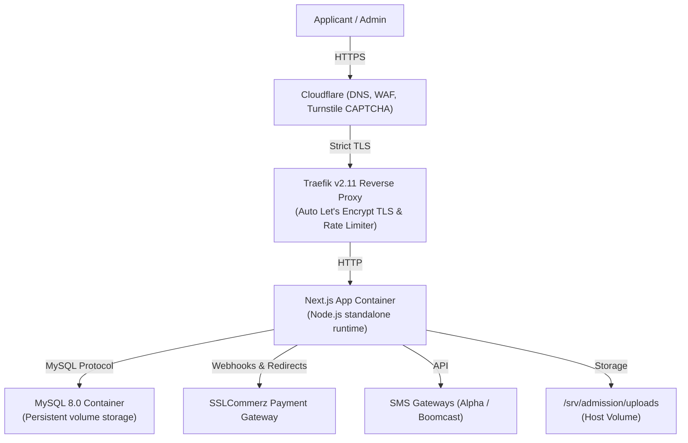

# Sylhet Engineering College (SEC) Admission Portal

A full-stack web application and infrastructure setup built for Sylhet Engineering College (affiliated with Shahjalal University of Science & Technology - SUST) to handle the complete undergraduate admission cycle: online applications, eligibility screening, SMS verification, digital payment settlement, automated admit card generation, and exam hall seat planning.

- **Live Production Portal:** [admission.sec.ac.bd](https://admission.sec.ac.bd)
- **Interactive Case Study:** [devcsl.tech/projects/sec-admission-portal](https://devcsl.tech/projects/sec-admission-portal)
- **Figma Design Prototype:** [Figma Project](https://www.figma.com/design/mQLbD97pdbG5IkjiZ3ffme/admission.sec.ac.bd?node-id=0-1&t=wGrVs4qlvLmU3bJx-1)
- **Developer Portfolio:** [devcsl.tech](https://devcsl.tech)

---

## Overview

Every year during college admissions, thousands of applicants attempt to register, check results, and pay fees within very tight deadlines. In the past, colleges struggled with traffic spikes, manual verification bottlenecks, and payment reconciliation issues.

I built this platform to automate that entire workflow from end to end:
1. **Applicants** can check eligibility against board results, verify their contact details via SMS OTP, upload photos and signatures, pay fees online, and download signed PDF admit cards.
2. **Administrators** have a centralized dashboard to track registrations, verify applications, distribute exam halls and seat numbers automatically, and broadcast urgent SMS updates.

The project began as an initial UI/UX prototype in [Figma](https://www.figma.com/design/mQLbD97pdbG5IkjiZ3ffme/admission.sec.ac.bd?node-id=0-1&t=wGrVs4qlvLmU3bJx-1) to map out applicant journeys. As requirements evolved during development—such as adding English Medium (O/A Level) tracks, supporting both mobile financial services and cards, and preventing automated bot spam—the architecture was expanded into the production system running today. Read the complete journey in the [case study](https://devcsl.tech/projects/sec-admission-portal).

---

## Architecture

The system is hosted on an Ubuntu Linux server, containerized with Docker, and routed through Traefik and Cloudflare.

---

## Key Features

### For Applicants
- **Automated Eligibility Check:** Students enter their SSC and HSC roll, board, and passing year. The system validates their eligibility criteria against the database before letting them proceed.
- **Support for Both Curriculums:** Dedicated registration workflows for both National Curriculum (HSC) and English Medium (O/A Level) candidates.
- **Phone & Email OTP Verification:** Contact numbers are verified using time-limited SMS OTPs, protected against abuse by cooldown timers and Cloudflare Turnstile.
- **Document Processing:** Photos and signatures are checked for dimensions and file size on the client side, then saved with unique IDs to prevent filename collisions.
- **Online Payment:** Integrated with SSLCommerz to support bKash, Nagad, Rocket, and credit/debit cards. Supports background IPN (Instant Payment Notification) so transactions are recorded even if the student's browser loses connection.
- **Dynamic PDF Admit Cards:** Generates printable PDF admit cards complete with candidate photo, roll number, assigned exam hall, and security seal.

### For Administrators
- **Live Overview:** Real-time stats on total applicants, payments verified, and department preferences.
- **Seat Allocation Engine:** Automatically assigns roll sequences and distributes applicants across designated exam rooms and buildings.
- **SMS Communication:** Filter candidates and send batch SMS notifications (exam dates, seat plans, reminders).
- **Payment Reconciliation:** Audit tools to review transaction status, search by transaction ID, and resolve pending payments.

---

## Tech Stack

- **Frontend & Backend:** Next.js 15 (App Router), React 19, Tailwind CSS, Framer Motion
- **Database:** MySQL 8.0 with connection pooling (`mysql2`)
- **Containerization & Routing:** Docker Compose, Traefik v2.11, Let's Encrypt (DNS-01 ACME)
- **Security & Bot Protection:** Cloudflare WAF, Cloudflare Turnstile, JWT session tokens (`jose`), rate limiting
- **Document & PDF Tools:** jsPDF, jsPDF-AutoTable, pdf-lib, sharp
- **Payment & Communication:** SSLCommerz Gateway, Alpha SMS, Boomcast SMS, Nodemailer

---

## Security & Reliability

Because admission portals deal with sensitive student data, payment transactions, and potential traffic bursts, security was built into each layer:

- **Bot and Abuse Prevention:** All public forms and OTP requests require Cloudflare Turnstile verification. Direct automated scripts (curl, Postman, Python requests) are blocked.
- **SMS Rate Limiting & Cooldowns:** To prevent SMS gateway depletion, OTP requests are restricted by:
  - Lifetime cap: Maximum 5 OTPs per applicant roll.
  - Same-phone cooldown: 5-minute wait between requests for the same number.
  - Hourly rate limits on both client IP and phone number.
  - Admin killswitch to pause OTP sending instantly if needed.
- **Upload Restrictions:** File uploads are only accepted after the applicant has verified their phone number via OTP. Uploads are limited to images/PDFs under size limits (200KB for photos, 1MB for transcripts) and renamed using random UUIDs.
- **Network Isolation:** The Next.js app binds strictly to `127.0.0.1:3000` inside the server. External traffic must go through Cloudflare and Traefik, preventing bypass of rate limits or SSL.
- **Role-Based Access Control:** Admin and student routes are guarded by JWT middleware. Student accounts require verified payment before accessing admit cards or downloadable copies.
- **Automated Database Backups:** Deployment scripts take an automated compressed SQL backup before running container rebuilds, with a one-line rollback mechanism (`rollback.sh`) if health checks fail.

---

## Design Evolution (Figma to Production)

The UI was originally designed in [Figma](https://www.figma.com/design/mQLbD97pdbG5IkjiZ3ffme/admission.sec.ac.bd?node-id=0-1&t=wGrVs4qlvLmU3bJx-1). 

During development, several real-world requirements led to iterative adjustments from the original mockups:
- **Form Pacing & Validation:** Transitioned from a single long page to a structured multi-step flow (Eligibility → Contact & OTP → Details & Upload → Payment) to reduce drop-offs on mobile devices.
- **Skeleton Loaders:** Replaced static loading spinners with a shimmering card skeleton that matches the exact layout of the portal cards, keeping the interface feeling fast on slower mobile connections.
- **Accessibility & Responsive Layout:** Ensured high-contrast readability and touch-friendly targets for applicants completing their forms on budget smartphones.

---

## Source Code Access & Enterprise Licensing

This is a proprietary production platform. To protect intellectual property and client data, the complete application source code is maintained in a private repository.

- **For Technical Recruiters & Engineering Hiring Managers:**  
  If you are evaluating my capabilities for a Senior Full-Stack Developer or DevOps/Platform Engineer role, I am happy to provide a live private code walkthrough or architectural deep-dive during an interview.

- **For Colleges, Universities & Organizations:**  
  To purchase a commercial license, full source code access, or a custom-branded deployment of this platform for your institution, please contact me directly.

---

## Commercial License & Institutional Rights

This project is proprietary software and is **not open source**. All intellectual property rights are reserved by the author.

### Institutional License Grant:
- **Sylhet Engineering College (SEC)** holds an authorized commercial institutional license purchased from the author to run, deploy, and operate this codebase exclusively for its institution under the institutional domain `sec.ac.bd` (including subdomains such as `admission.sec.ac.bd`) across its servers.
- This license is non-transferable and strictly restricted to Sylhet Engineering College and the `sec.ac.bd` domain.

### Commercial Inquiries & Purchases:
If you represent another college, university, or educational board wishing to purchase a commercial license, turnkey deployment, or white-label instance of this platform:

- **Author:** Omar Faruk
- **Portfolio:** [devcsl.tech](https://devcsl.tech)
- **Detailed Case Study:** [devcsl.tech/projects/sec-admission-portal](https://devcsl.tech/projects/sec-admission-portal)
- **Email:** [cslomarfaruk@gmail.com](mailto:cslomarfaruk@gmail.com)
- **Live Portal:** [admission.sec.ac.bd](https://admission.sec.ac.bd)
- **GitHub:** [@cslomarfaruk](https://github.com/cslomarfaruk)

Unauthorized copying, reproduction, distribution, or deployment outside the authorized `sec.ac.bd` domain is strictly prohibited. See [LICENSE](LICENSE) for full legal terms.
